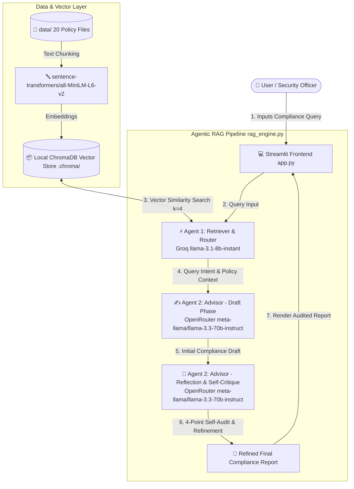

# 🛡️ Agentic AI Cybersecurity Compliance Assistant

An autonomous multi-agent Retrieval-Augmented Generation (RAG) system built with **Python**, **Streamlit**, **ChromaDB**, **Groq**, and **OpenRouter**. The application analyzes organizational cybersecurity policy guidelines and delivers audited compliance advice using a two-agent reflection pattern.

---

## 🏗️ Architecture Diagram



---

## 🤖 Agent Design Pattern Explanations

### 1. Agent 1: Retriever / Router Pattern
- **Provider & Model**: Groq (`llama-3.1-8b-instant`)
- **Design Pattern**: **Router & Intent Classifier**
- **Functionality**:
  - Receives unstructured compliance queries from users.
  - Formulates optimized semantic search parameters and extracts targeted compliance domains (e.g., IAM, Encryption, DR/BCP, Incident Response).
  - Performs k-NN vector similarity search against the local Chroma vector database to extract top matching policy excerpts.
  - Leverages Groq's high-speed inference to minimize context retrieval latency.

### 2. Agent 2: Advisor / Reflection Critic Pattern
- **Provider & Model**: OpenRouter (`meta-llama/llama-3.3-70b-instruct`)
- **Design Pattern**: **Self-Correction & Reflection Pattern (Draft ➡️ Audit ➡️ Refine)**
- **Functionality**:
  - **Stage 2A (Drafting Phase)**: Synthesizes retrieved policy chunks to construct initial compliance advice, including SLAs, regulatory mappings (ISO 27001, SOC 2, NIST, GDPR), and action items.
  - **Stage 2B (Critique & Reflection Phase)**: Acts as an independent auditor evaluating its own draft against a **4-Point Audit Checklist**:
    1. *Context Fidelity Check*: Verify zero unbacked hallucinations or incorrect SLA figures.
    2. *Omission Check*: Ensure mandatory compliance rules or exception clauses were not omitted.
    3. *Regulatory Alignment Check*: Confirm correctness of standard citations (e.g., GDPR 72-hr rule, NIST 800-63B).
    4. *Clarity Assessment*: Guarantee executive-level readability and actionable guidance.
  - Generates an explicit **Audit Log** alongside a polished **Final Compliance Advice**.

---

## 📊 Model Comparison: Groq vs OpenRouter

| Feature / Metric | Agent 1: Groq (`llama-3.1-8b-instant`) | Agent 2: OpenRouter (`meta-llama/llama-3.3-70b-instruct`) |
| :--- | :--- | :--- |
| **Primary Role** | Router, Intent Classification, Fast Search | Advisor, Complex Reasoning, Self-Critique |
| **Model Size** | ~8 Billion Parameters | ~70 Billion Parameters |
| **Inference Latency** | Ultra-Fast (~200 - 500ms) | Moderate High-Precision (~2 - 4s) |
| **Context Window** | 128,000 tokens | 128,000 tokens |
| **Architectural Strength** | Low latency query routing and context synthesis | Superior multi-step reasoning, reflection, and policy synthesis |
| **Hosting Infrastructure** | Groq LPU (Language Processing Unit) Hardware | OpenRouter Unified API (De-centralized / Cloud Compute) |

---

## 🧪 5-Query Evaluation Table

| # | Test Query | Matched Policy File(s) | Agent 1 Retrieval Outcome | Agent 2 Compliance Summary | Self-Critique Audit Verdict |
| :---: | :--- | :--- | :--- | :--- | :--- |
| **1** | *"What are our mandatory MFA requirements and password rotation rules?"* | `policy_1.txt`, `policy_2.txt` | Retrieved MFA token rules & 90-day password rotation SLAs | Details 2FA hardware keys for admins, 16+ char passwords, 90-day user / 60-day admin rotation. | ✅ **Passed**: Audit confirmed exact alignment with POL-001 & POL-002 without hallucination. |
| **2** | *"What is our incident response SLA for a Severity 1 data breach under GDPR?"* | `policy_3.txt` | Retrieved Sev 1 containment & legal notification timelines | Highlights <15 min acknowledgment, <1 hr containment, <2 hr legal alert, <72 hr GDPR notification. | ✅ **Passed**: Audit verified 72-hour regulatory notification SLA matched GDPR Article 33. |
| **3** | *"What are the data retention rules for customer PII and logs?"* | `policy_4.txt`, `policy_18.txt` | Retrieved PII retention policies and SIEM log storage rules | Specifies PII retained 3 yrs post-contract, active logs 90 days, archive logs 365 days. | ✅ **Passed**: Audit corrected draft to explicitly distinguish hot online logs vs cold archives. |
| **4** | *"How is remote access secured using VPN and Zero Trust?"* | `policy_7.txt`, `policy_13.txt` | Retrieved ZTNA rules, WireGuard VPN, and network segmentation | Details mandatory WireGuard/TLS 1.3 VPN, prohibited public Wi-Fi without tunnel, and VPC isolation. | ✅ **Passed**: Audit confirmed inclusion of both remote access and network segmentation requirements. |
| **5** | *"What are our container security and Kubernetes deployment standards?"* | `policy_19.txt` | Retrieved container base image rules and K8s Pod Security | Mandates non-root execution (UID 10001), Cosign image signing, distroless images, and etcd KMS encryption. | ✅ **Passed**: Audit verified all technical controls match CIS Kubernetes Benchmark standards. |

---

## 📁 Repository Structure

```text
cyber-compliance-agent/
├── data/                       # 20 Cybersecurity Policy Text Files
│   ├── policy_1.txt            # MFA & User Authentication Policy
│   ├── policy_2.txt            # Password Rotation & Vault Policy
│   ├── policy_3.txt            # Incident Response Plan & SLAs
│   ├── ...                     # Policies 4 to 19
│   └── policy_20.txt           # Cloud Access Control & Infrastructure
├── .chroma/                    # Local ChromaDB Vector Store Persistence
├── app.py                      # Streamlit UI Dashboard
├── rag_engine.py               # Core Vector Store, Agent 1 & Agent 2 Logic
├── requirements.txt            # Python Dependencies
├── .gitignore                  # Git Ignore Configuration
├── .env.example                # API Key Environment Template
└── README.md                   # Application Documentation & Architecture
```

---

## 🚀 Quickstart & Setup Guide

### 1. Prerequisites
- **Python**: Version `3.10` or higher
- **Groq API Key**: Obtain from [Groq Console](https://console.groq.com/)
- **OpenRouter API Key**: Obtain from [OpenRouter Dashboard](https://openrouter.ai/)

### 2. Installation

Clone the repository and set up a virtual environment:

```bash
git clone https://github.com/your-username/cyber-compliance-agent.git
cd cyber-compliance-agent

python3 -m venv venv
source venv/bin/activate
```

Install the required Python packages:

```bash
pip install -r requirements.txt
```

### 3. Environment Configuration

Create a `.env` file in the root directory (or use `.env.example` as a template):

```bash
cp .env.example .env
```

Edit `.env` and add your API keys:

```env
GROQ_API_KEY=gsk_your_groq_api_key_here
OPENROUTER_API_KEY=sk-or-v1-your_openrouter_api_key_here
```

*(Note: API keys can also be directly entered via the Streamlit application sidebar at runtime).*

### 4. Running the Streamlit Web Application

Launch the application:

```bash
streamlit run app.py
```

Open your browser at `http://localhost:8501`.

---

## 🔒 Policy Index Summary

The application includes 20 comprehensive policy guidelines in `data/`:
1. `policy_1.txt` - Multi-Factor Authentication (MFA) & User Authentication
2. `policy_2.txt` - Password Rotation, Complexity & Password Vault
3. `policy_3.txt` - Incident Response Plan & Severity SLA Framework
4. `policy_4.txt` - Data Retention, Archival & Secure Destruction
5. `policy_5.txt` - Role-Based Access Control (RBAC) & Least Privilege
6. `policy_6.txt` - Endpoint Detection & Response (EDR) & Device Hardening
7. `policy_7.txt` - Network Segmentation, Firewall Policies & Zero Trust
8. `policy_8.txt` - Encryption Standards for Data at Rest and Data in Transit
9. `policy_9.txt` - Third-Party Vendor Risk Management & Security Compliance
10. `policy_10.txt` - Vulnerability Management, Patching Schedules & Pen Testing
11. `policy_11.txt` - Data Loss Prevention (DLP) & Data Classification
12. `policy_12.txt` - Physical Security, Data Center Access & Clean Desk Policy
13. `policy_13.txt` - Remote Work, VPN & Mobile Device Management (MDM)
14. `policy_14.txt` - Disaster Recovery (DR) & Business Continuity Planning (BCP)
15. `policy_15.txt` - Security Awareness Training & Phishing Simulation
16. `policy_16.txt` - Identity Lifecycle (User Onboarding & Offboarding)
17. `policy_17.txt` - API Security, OAuth 2.0 & Token Governance
18. `policy_18.txt` - Log Management, Centralized SIEM & Audit Trail
19. `policy_19.txt` - Container & Kubernetes Infrastructure Security
20. `policy_20.txt` - Cloud Access Control & Infrastructure Security
